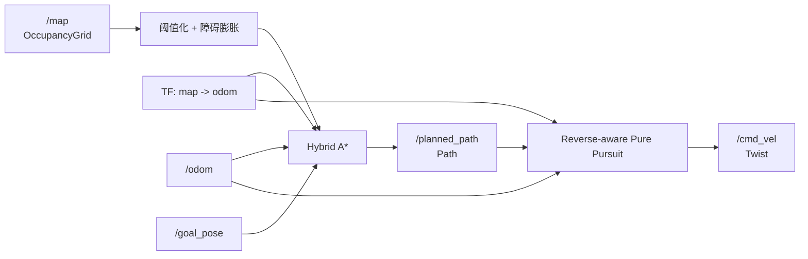

# ROS 2 Hybrid A* 路径规划与跟踪

一个面向非完整约束移动机器人的 ROS 2 路径规划项目：从 `nav_msgs/OccupancyGrid`
构建安全栅格地图，使用 Hybrid A* 生成满足车辆运动学约束的路径，再由 Pure Pursuit
控制器完成闭环跟踪。

> 当前版本以 ROS 2 Jazzy、Python 3、Gazebo Sim 和 RViz2 为主要运行环境。

## 项目亮点

- 从零实现 Hybrid A* 搜索，状态包含二维位置、航向角与前进/倒车方向。
- 使用 8 邻域 Dijkstra 预计算考虑障碍物的启发代价，避免欧氏距离启发在死胡同中盲目扩展。
- 基于自行车模型生成运动基元，并对整段运动进行采样碰撞检测，避免大步长“跨墙”。
- 支持机器人半径膨胀、未知区域安全策略、方向切换惩罚和搜索上限。
- 通过 TF 将 `/odom`、`/amcl_pose`、`/initialpose` 和 `/goal_pose` 统一转换到地图坐标系，避免跨 frame 直接混用。
- 控制器可根据路径航向自动识别前进/倒车段，并发布正向或负向 `cmd_vel`。
- 完成 ROS 2 地图、里程计、目标位姿、路径与速度指令的端到端集成。
- 所有关键规划/控制参数均可通过 ROS 参数 YAML 调整，启动文件不依赖开发者本机路径。
- 核心算法与 ROS 解耦，提供快速单元测试验证启发函数、碰撞检测和绕障能力。

## TODO

未考虑到目标点的yaw角，判断是否到达目标点只考虑了机器人到目标点的距离


## 系统流程



## 算法设计

1. 将 ROS 地图按 `grid[y, x]` 解析，默认将占用值大于 50 及未知区域视为障碍。
2. 根据机器人安全半径生成圆形结构元素，并使用 SciPy 二值膨胀构造安全边界。
3. 从目标点执行 8 邻域 Dijkstra，得到包含障碍绕行代价的二维启发图。
4. 使用自行车运动学模型扩展 `(x, y, yaw, direction)` 状态，并离散航向用于去重。
5. 对运动基元全程采样碰撞检测，同时加入倒车、换向与转向惩罚。
6. 将轨迹恢复为带航向四元数的 `nav_msgs/Path`，控制器据此推断前进/倒车段并跟踪。

## 环境要求

- Ubuntu 24.04
- ROS 2 Jazzy
- NumPy、SciPy
- Nav2 Map Server
- RViz2
- 可选：Gazebo Sim、`ros_gz`、自定义机器人描述包

安装 ROS 依赖：

```bash
cd ~/ros2_ws
rosdep install --from-paths src --ignore-src -r -y
```

## 构建与测试

将本项目放入 ROS 2 工作空间的 `src/` 后执行：

```bash
cd ~/ros2_ws
colcon build --packages-select hybrid_algorithm_pkg --symlink-install
source install/setup.bash
colcon test --packages-select hybrid_algorithm_pkg
colcon test-result --verbose
```

无需 ROS 图形环境也可单独验证算法核心：

```bash
python3 -m pytest -q src/hybrid_algorithm_pkg/test/test_hybrid_astar.py
```

## 运行

### 连接已有地图与机器人

如果系统已发布 `/map`、`/odom` 并接收 `/cmd_vel`：

```bash
ros2 launch hybrid_algorithm_pkg planner.launch.py
```

在 RViz2 中使用 **2D Goal Pose** 发布目标。默认从 `/odom` 获取起点，并通过 TF 转换到地图 frame。
需要切换起点来源时，设置 `start_pose_source` 为 `odom`、`amcl` 或 `initialpose`。
使用 AMCL 时，先用 **2D Pose Estimate** 发布 `/initialpose`，AMCL 才会稳定发布 `map -> odom`。

只运行规划器、不启动控制器或 RViz：

```bash
ros2 launch hybrid_algorithm_pkg planner.launch.py \
  enable_controller:=false enable_rviz:=false
```

### Gazebo Sim 集成

仿真启动文件默认使用包内自带的世界、地图、Gazebo model 和机器人 URDF，构建后可直接运行：

```bash
ros2 launch hybrid_algorithm_pkg gazebo_sim.launch.py
```

如需替换自己的世界或地图，也可以显式传入路径：

```bash
ros2 launch hybrid_algorithm_pkg gazebo_sim.launch.py \
  world:=/absolute/path/to/world.sdf \
  map:=/absolute/path/to/map.yaml
```

该启动文件默认启用 AMCL，并将规划起点设为 `/amcl_pose`。启动后需要在 RViz2 中使用 **2D Pose Estimate** 完成 AMCL 初始位姿设置。无界面运行可追加 `headless:=true`。若没有可用激光或定位节点，可用
`enable_amcl:=false start_pose_source:=odom` 回退到静态 `map -> odom` 示例。
包内示例地图位于 `maps/my_map.yaml`，示例世界位于 `worlds/hybrid_house.world`，机器人描述位于 `urdf/hybrid_fishbot.urdf`，安装后都会随包一起进入 share 目录。

## 主要接口

| 类型 | 名称 | 消息 | 说明 |
| --- | --- | --- | --- |
| 订阅 | `/map` | `nav_msgs/OccupancyGrid` | 静态或 SLAM 地图 |
| 订阅 | `/odom` | `nav_msgs/Odometry` | 当前机器人位姿 |
| 订阅 | `/initialpose` | `geometry_msgs/PoseWithCovarianceStamped` | RViz 初始位姿或可选手动起点 |
| 订阅 | `/amcl_pose` | `geometry_msgs/PoseWithCovarianceStamped` | AMCL 定位位姿，可作为规划起点 |
| 订阅 | `/goal_pose` | `geometry_msgs/PoseStamped` | RViz 目标位姿 |
| 发布 | `/planned_path` | `nav_msgs/Path` | 带航向的规划轨迹 |
| 发布 | `/cmd_vel` | `geometry_msgs/Twist` | 控制器速度指令 |

## 常用参数

| 参数 | 默认值 | 含义 |
| --- | ---: | --- |
| `map_frame` | `map` | 规划与控制统一使用的地图坐标系 |
| `start_pose_source` | `odom` | 规划起点来源，可选 `odom`、`amcl`、`initialpose` |
| `robot_radius` | 0.25 m | 地图障碍膨胀半径 |
| `motion_step` | 0.20 m | 单个运动基元长度 |
| `wheelbase` | 0.40 m | 自行车模型等效轴距 |
| `max_steering_angle_deg` | 30° | 最大转向角 |
| `heading_bins` | 72 | 航向离散数量 |
| `max_iterations` | 250000 | 单次搜索扩展上限 |
| `lookahead_distance` | 0.40 m | Pure Pursuit 预瞄距离 |
| `target_speed` | 0.20 m/s | 跟踪目标速度，倒车段自动取负 |

完整配置见 `config/planner_params.yaml`。

## 项目结构

```text
hybrid_algorithm_pkg/
├── config/                         # ROS 参数与 RViz 配置
├── hybrid_algorithm_pkg/
│   ├── hybrid_astar.py             # ROS 无关的规划算法核心
│   ├── hybrid_algorithm_planner.py # OccupancyGrid/Path 适配节点
│   └── pure_pursuit_controller.py  # 路径跟踪控制器
├── launch/                         # 独立规划、Gazebo 与可选 SLAM 启动
├── maps/                           # 示例静态地图
├── models/                         # Gazebo 示例环境模型
├── urdf/                           # 示例机器人描述
├── worlds/                         # Gazebo 示例世界
├── test/                           # 算法单测与 ROS 代码规范检查
├── package.xml
└── setup.py
```

## 已知边界

- 当前碰撞模型以膨胀后的质点栅格近似机器人轮廓，尚未实现随航向变化的多边形 footprint。
- 包内 demo world 与 map 需要保持同一环境坐标；替换自定义地图时应同步替换 Gazebo world。
- 当前规划在目标回调中同步执行；超大地图可进一步改为工作线程或 ROS 2 Action Server。
- `map -> odom` 的定位关系应由真实定位系统提供；Gazebo 示例默认使用 AMCL，关闭 AMCL 时才使用单位静态变换作为演示回退。

## License

Apache-2.0，详见 [LICENSE](LICENSE)。
